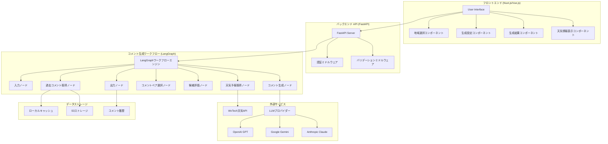
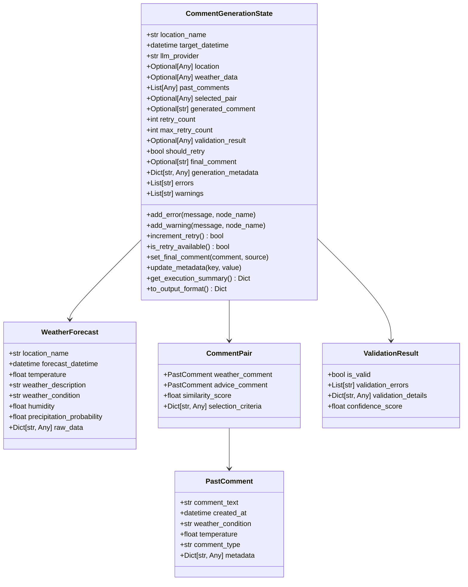
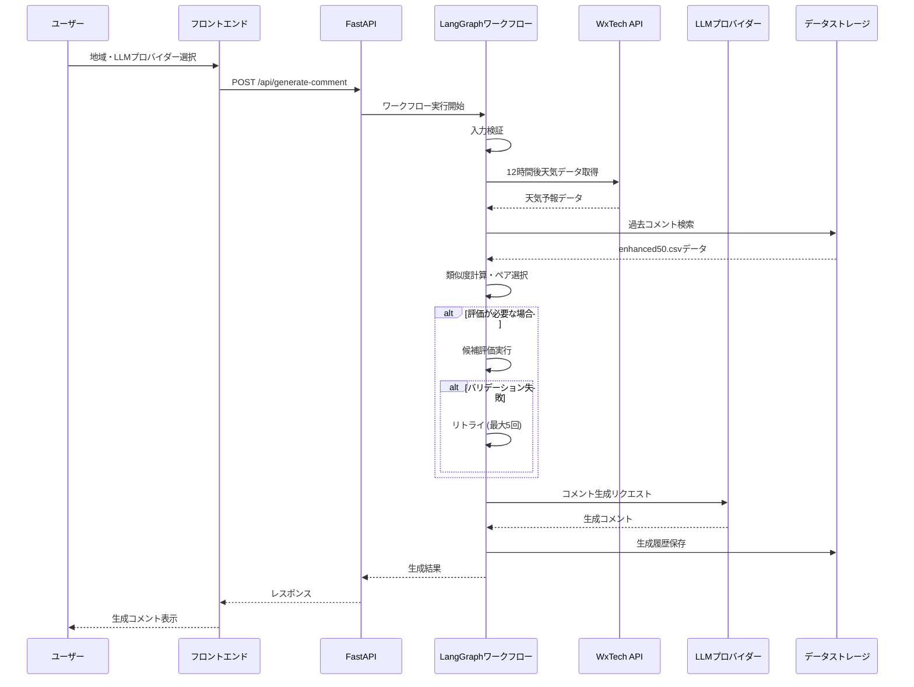
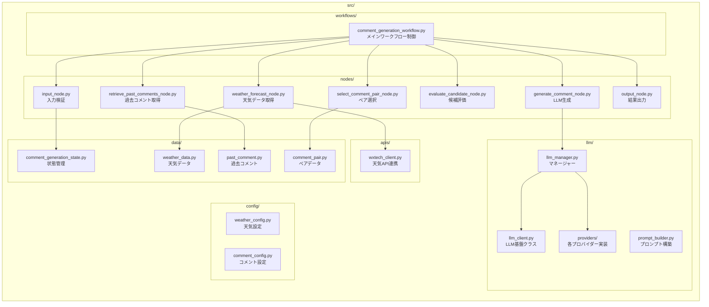

# MobileCommentGenerator 詳細仕様図とアーキテクチャ

## システム全体アーキテクチャ



## LangGraphワークフロー詳細フロー

```mermaid
graph TD
    Start([開始]) --> Input[入力ノード]
    Input --> |地域・時刻・LLMプロバイダー検証| WeatherForecast[天気予報取得ノード]
    
    WeatherForecast --> |WxTech API呼び出し| RetrievePast[過去コメント取得ノード]
    RetrievePast --> |enhanced50.csv解析| SelectPair[コメントペア選択ノード]
    
    SelectPair --> |適応度計算| ShouldEvaluate{評価が必要？}
    
    ShouldEvaluate --> |Yes| Evaluate[候補評価ノード]
    ShouldEvaluate --> |No| Generate[コメント生成ノード]
    
    Evaluate --> |バリデーション実行| ShouldRetry{リトライが必要？}
    
    ShouldRetry --> |Yes (最大5回)| SelectPair
    ShouldRetry --> |No| Generate
    
    Generate --> |LLM呼び出し| Output[出力ノード]
    Output --> |最終コメント保存| End([終了])

    style Start fill:#e1f5fe
    style End fill:#f3e5f5
    style ShouldEvaluate fill:#fff3e0
    style ShouldRetry fill:#fff3e0
```

## データモデル仕様



## コンポーネント間通信仕様



## ファイル構成と責務



## 主要アルゴリズム仕様

### 1. コメントペア選択アルゴリズム
```
1. 現在の天気情報を基準パラメータとして設定
2. enhanced50.csvから候補コメントを全件取得
3. 各候補に対して類似度スコア計算:
   - 気温差による重み付け (重要度: 40%)
   - 天気条件マッチング (重要度: 35%)
   - 時間帯考慮 (重要度: 25%)
4. 上位ペアを選出し、多様性確保のためフィルタリング
5. 最適ペアを返却
```

### 2. 天気情報優先度ルール
```
優先度1: 猛暑日(35℃以上) → 「危険な暑さ」系コメント
優先度2: 真夏日(30℃以上) → 「暑い」系コメント  
優先度3: 雨天 → 「雨対策」系コメント
優先度4: 冬季(0℃以下) → 「寒さ対策」系コメント
優先度5: その他 → 一般的な天気コメント
```

### 3. リトライ制御フロー
```
IF 評価結果が無効 AND リトライ回数 < 5:
    retry_count++
    selected_pair = null
    validation_result = null
    GOTO コメントペア選択
ELSE:
    GOTO コメント生成
```

## 設定・閾値仕様

### 天気判定閾値
- **猛暑日**: 35℃以上
- **真夏日**: 30℃以上  
- **冬日**: 0℃以下
- **降水確率高**: 70%以上
- **湿度高**: 80%以上

### システム制御値
- **最大リトライ回数**: 5回
- **キャッシュ保持期間**: 3.6時間
- **予報取得時間**: 12時間後
- **コメント最大文字数**: 150文字

### LLMプロバイダー別設定
```yaml
OpenAI:
  model: "gpt-4"
  temperature: 0.7
  max_tokens: 200

Gemini:
  model: "gemini-pro" 
  temperature: 0.8
  max_tokens: 200

Anthropic:
  model: "claude-3-sonnet"
  temperature: 0.6
  max_tokens: 200
```

## パフォーマンス要件

- **応答時間**: 平均5秒以内、最大15秒
- **同時処理**: 最大50リクエスト/秒
- **稼働率**: 99.5%以上
- **エラーハンドリング**: 全ノードで例外捕捉・ログ記録
- **ログレベル**: critical/error/warning/info/debug

## フロントエンド仕様

### コンポーネント構成
- **LocationSelection.vue**: 地域選択（地区別リスト・検索機能・フィルタリング機能）
- **GenerateSettings.vue**: 設定コンポーネント（LLMプロバイダー選択・生成オプション設定）
- **GeneratedComment.vue**: 生成結果コンポーネント（コメント・履歴・コピー機能）
- **WeatherData.vue**: 天気情報表示コンポーネント（現在・予報天気データ・詳細情報表示）

### 状態管理（Pinia）
```typescript
interface AppState {
  selectedLocation: Location | null;
  currentWeather: WeatherData | null;
  generatedComment: GeneratedComment | null;
  isGenerating: boolean;
  history: GeneratedComment[];
  errors: string[];
}
```

### API通信仕様
```typescript
// REST API呼び出し・エラーハンドリング・ローディング状態管理
export const useApi = () => {
  const generateComment = async (params: GenerateSettings): Promise<GeneratedComment>
  const getLocations = async (): Promise<Location[]>
  const getHistory = async (): Promise<GeneratedComment[]>
}
```

## API仕様

### エンドポイント一覧

| エンドポイント | メソッド | 説明 |
|---|---|---|
| `/api/generate-comment` | POST | コメント生成 |
| `/api/locations` | GET | 地域一覧取得 |
| `/api/weather/{location_id}` | GET | 天気情報取得 |
| `/api/history` | GET | 生成履歴取得 |
| `/api/health` | GET | ヘルスチェック |

### リクエスト・レスポンス例

```json
POST /api/generate-comment
{
  "location_name": "東京",
  "target_datetime": "2025-06-18T15:00:00Z",
  "llm_provider": "openai"
}

Response:
{
  "success": true,
  "final_comment": "今日は穏やかで過ごしやすい一日ですね。お出かけ日和です！",
  "generation_metadata": {
    "execution_time_ms": 4500,
    "retry_count": 0,
    "weather_condition": "晴れ",
    "temperature": 24.5
  }
}
```

## 実装状況と進捗

### ✅ 完了済み (100%)
- [x] **地域データ管理システム**: CSV読み込み・検索・位置情報取得機能
- [x] **天気予報API連携**: WxTech API統合（12時間後データ対応）
- [x] **過去コメント取得**: enhanced50.csvベースのデータ解析・類似度計算
- [x] **LLM統合**: マルチプロバイダー対応（OpenAI/Gemini/Anthropic）

### ✅ 完了済み (100%) - LangGraphワークフロー
- [x] **SelectCommentPairNode**: コメント類似度計算ベースによる選択
- [x] **EvaluateCandidateNode**: 複数基準による評価
- [x] **基本ワークフロー**: 順次実行ノードでの段階実装
- [x] **InputNode/OutputNode**: 本実装完了
- [x] **GenerateCommentNode**: LLM統合実装
- [x] **統合テスト**: エンドtoエンド状態確認

### ✅ 完了済み (100%) - Streamlit UI
- [x] **基本UI実装**: 地域選択・LLMプロバイダー選択・コメント生成
- [x] **詳細情報表示**: 現在・予報天気データ・詳細情報表示
- [x] **バッチ出力**: 複数地域一括出力機能
- [x] **CSV出力**: 生成結果のエクスポート機能
- [x] **エラーハンドリング**: ユーザーフレンドリーなエラー表示

### ✅ 完了済み (100%) - フロントエンド分離
- [x] **フロントエンド分離**: Vue.js/Nuxt.jsを独立プロジェクトに移行
- [x] **プロジェクト連携の明確化**: frontend/とsrc/の責務分離
- [x] **API実装**: FastAPI RESTful APIエンドポイント完了
- [x] **統合ドキュメント**: フロントエンド・バックエンド連携ガイド
- [x] **UIコンポーネント**: 地域選択・設定・生成結果・天気情報表示の完全実装

### 🚧 Phase 5: デプロイメント (0%完了)
- [ ] **AWSデプロイメント**: Lambda/ECS・CloudWatch統合

## 開発環境セットアップ

### 必須要件
- Python 3.10+
- Node.js 18+
- Docker (オプション)

### セットアップ手順

```bash
# 1. リポジトリクローン
git clone https://github.com/sakamo-wni/MobileCommentGenerator.git
cd MobileCommentGenerator

# 2. 仮想環境セットアップ
python -m venv venv
source venv/bin/activate  # Windows: venv\Scripts\activate

# 3. 依存関係インストール
pip install -r requirements.txt

# 4. 環境変数設定
cp .env.example .env
# .envファイルにAPIキーを設定

# 5. フロントエンド環境セットアップ
cd frontend
npm install

# 6. 開発サーバー起動
# バックエンド (ターミナル1)
cd ..
python api_server.py

# フロントエンド (ターミナル2)  
cd frontend
npm run dev
```

### テスト実行

```bash
# 全テスト実行
make test

# カバレッジ付きテスト
make test-cov

# 統合テスト
make test-integration
```

## 貢献方法

1. Issue作成で問題報告・機能要望
2. Fork & Pull Requestでの貢献
3. [開発ガイドライン](docs/CONTRIBUTING.md)に従った開発

## サポート

問題が解決しない場合は、GitHubのIssuesで報告してください。
