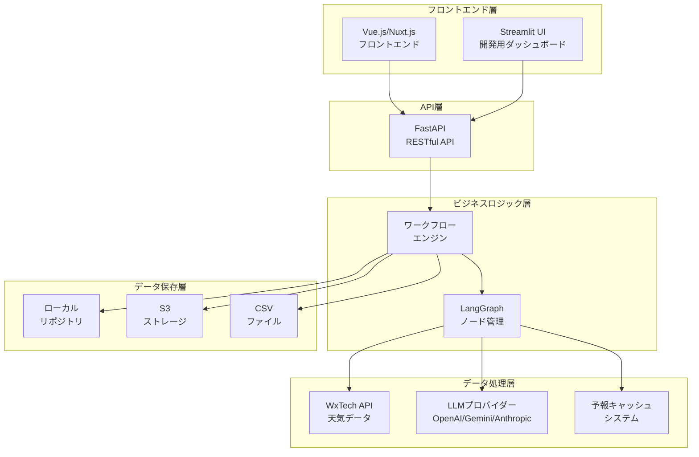
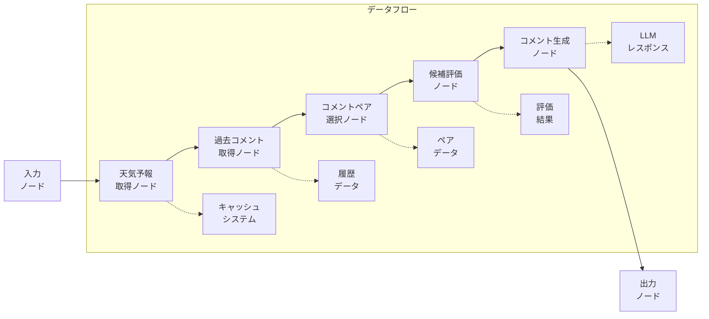
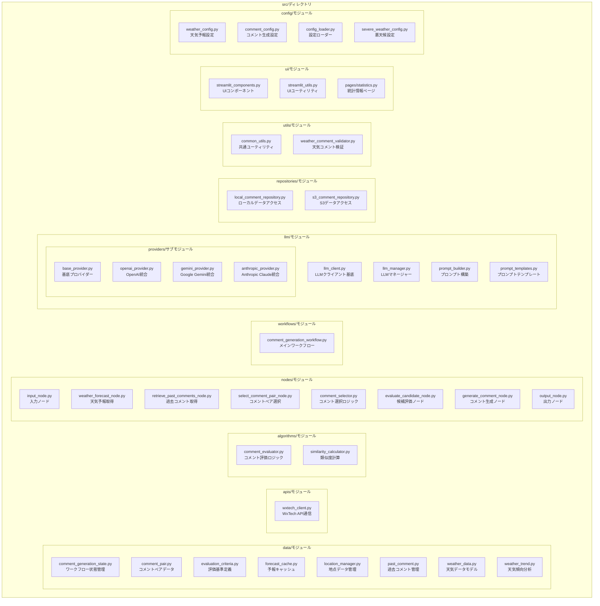
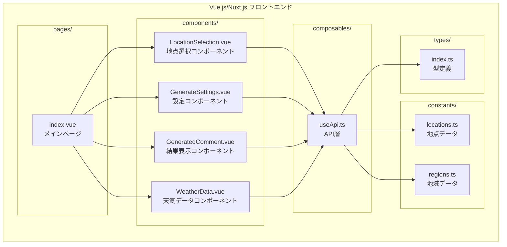
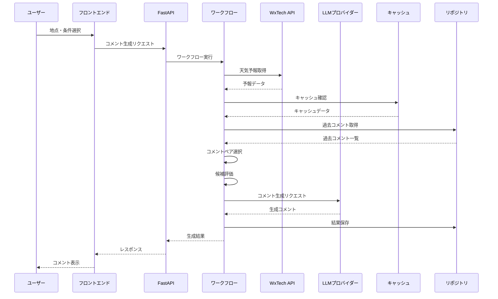
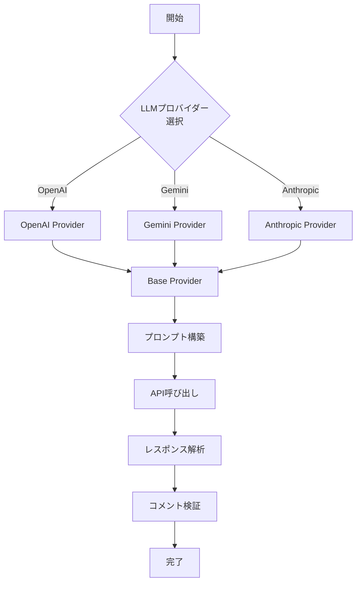
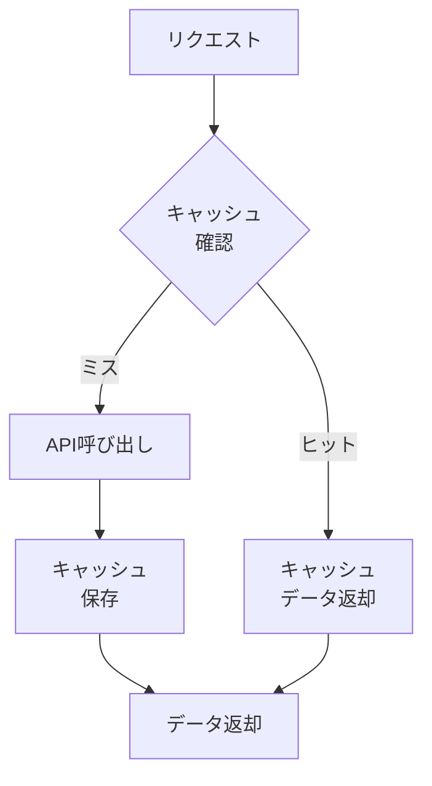
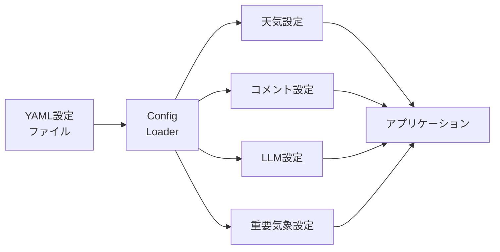
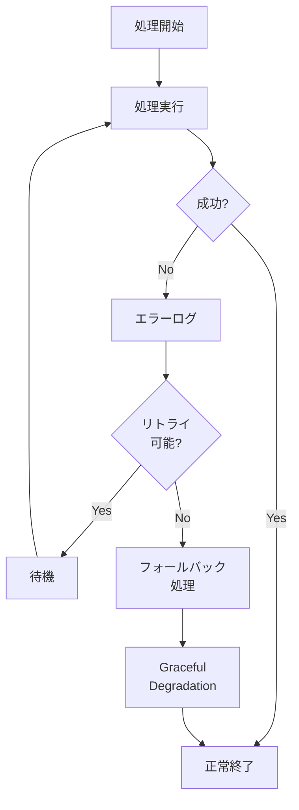

# 天気予報コメント生成システム 🎯

LangGraphとLLMを活用した天気予報コメント自動生成システムです。指定した各地点の天気情報と過去のコメントデータをもとに、LLM（大規模言語モデル）を利用して短い天気コメント（約15文字）を自動生成します。

## 🌟 最新アップデート (2025-06-16)

- **✅ コメント重複検出と代替選択機能**: 天気コメントとアドバイスコメントの重複を検出し、代替ペアを自動選択
- **✅ 天気条件柔軟性向上機能**: 暖冬時期の「変わりやすい種」表現や31℃以下での「冷中緻」表現を制限
- **✅ 意図的知見対象パターン検出**: 「日差し使用」vs「紫外線対象」など知見対象の表現の組み合わせを強化
- **✅ ログレベル最適化**: デバッグ用送信のcriticalレベル使用を高効率なdebug/infoレベルに修正
- **✅ 文字列整理機能強化**: 単一地点情報取得の安全性向上と正確表現の不整合解消
- **✅ システム改善**: エラーハンドリング強化とパフォーマンス向上


## 📊 詳細仕様図とアーキテクチャ

### 🏗️ システム全体アーキテクチャ



### 🔄 LangGraphワークフロー詳細



### 📦 モジュール構成図



### 🌐 フロントエンド アーキテクチャ



### 🔗 データフロー図



### 🧠 LLMプロバイダー選択フロー



### 🏛️ アーキテクチャパターン

#### レイヤードアーキテクチャ
```
┌─────────────────────────────────────┐
│         プレゼンテーション層          │ ← Vue.js/Nuxt.js + Streamlit
├─────────────────────────────────────┤
│            API層                   │ ← FastAPI
├─────────────────────────────────────┤
│         ビジネスロジック層           │ ← LangGraph Workflows
├─────────────────────────────────────┤
│         データアクセス層             │ ← Repositories
├─────────────────────────────────────┤
│         インフラストラクチャ層        │ ← WxTech API, LLMs, Storage
└─────────────────────────────────────┘
```

#### 依存性注入パターン
- **LLMプロバイダー**: 複数のLLMプロバイダーを統一インターフェースで管理
- **データリポジトリ**: ローカル/S3ストレージを抽象化
- **設定管理**: YAML設定ファイルによる柔軟な設定管理

#### ワークフローパターン
- **LangGraphベース**: ノード間の状態管理と依存関係を明確化
- **非同期処理**: 各ノードは非同期で実行可能
- **エラーハンドリング**: 各段階でのエラー処理とリトライ機能

### 📈 パフォーマンス最適化

#### キャッシュ戦略


#### 非同期処理フロー
- **並行実行**: 天気データ取得と過去コメント取得の並行処理
- **バッチ処理**: 複数地点の一括処理機能
- **ストリーミング**: リアルタイムでの進捗表示

### 🔧 設定管理アーキテクチャ



### 🛡️ エラーハンドリング戦略



## 📗 プロジェクト構成

```
MobileCommentGenerator/
├── src/                              # バックエンドPythonアプリケーション
│   ├── data/                         # データクラス管理
│   │   ├── comment_generation_state.py   # ワークフロー状態管理
│   │   ├── comment_pair.py               # コメントペアデータモデル
│   │   ├── evaluation_criteria.py       # 評価基準定義
│   │   ├── forecast_cache.py             # 天気予報キャッシュ管理
│   │   ├── location_manager.py           # 地点データ管理
│   │   ├── past_comment.py               # 過去コメント管理
│   │   ├── weather_data.py               # 天気データモデル
│   │   ├── weather_trend.py              # 天気傾向分析
│   │   └── Chiten.csv                    # 地点マスターデータ
│   ├── apis/                         # 外部API連携
│   │   └── wxtech_client.py              # WxTech天気API統合
│   ├── algorithms/                   # アルゴリズム実装
│   │   ├── comment_evaluator.py          # コメント評価ロジック
│   │   └── similarity_calculator.py     # 類似度計算
│   ├── nodes/                        # LangGraphノード
│   │   ├── input_node.py                 # 入力ノード
│   │   ├── weather_forecast_node.py      # 天気予報取得ノード
│   │   ├── retrieve_past_comments_node.py # 過去コメント取得ノード
│   │   ├── select_comment_pair_node.py    # コメントペア選択ノード
│   │   ├── comment_selector.py           # コメント選択ロジック
│   │   ├── evaluate_candidate_node.py     # 候補評価ノード
│   │   ├── generate_comment_node.py       # コメント生成ノード
│   │   ├── output_node.py                # 出力ノード
│   │   └── mock_nodes.py                 # モックノード（テスト用）
│   ├── workflows/                    # ワークフロー実装
│   │   └── comment_generation_workflow.py
│   ├── llm/                          # LLM統合
│   │   ├── llm_client.py                 # LLMクライアント基底
│   │   ├── llm_manager.py                # LLMマネージャー
│   │   ├── prompt_builder.py             # プロンプト構築
│   │   ├── prompt_templates.py           # プロンプトテンプレート
│   │   └── providers/                    # LLMプロバイダー実装
│   │       ├── base_provider.py          # 基底プロバイダー
│   │       ├── openai_provider.py        # OpenAI統合
│   │       ├── gemini_provider.py        # Google Gemini統合
│   │       └── anthropic_provider.py     # Anthropic Claude統合
│   ├── repositories/                 # データリポジトリ
│   │   ├── local_comment_repository.py   # ローカルデータアクセス
│   │   └── s3_comment_repository.py      # S3データアクセス
│   ├── utils/                        # ユーティリティ
│   │   ├── common_utils.py               # 共通ユーティリティ
│   │   └── weather_comment_validator.py # 天気コメント検証
│   ├── ui/                           # Streamlit UI
│   │   ├── streamlit_components.py       # UIコンポーネント
│   │   ├── streamlit_utils.py            # UIユーティリティ
│   │   └── pages/                        # マルチページ構成
│   │       └── statistics.py             # 統計情報ページ
│   └── config/                       # 設定管理
│       ├── weather_config.py             # 天気予報設定
│       ├── comment_config.py             # コメント生成設定
│       ├── config_loader.py              # 設定ローダー
│       └── severe_weather_config.py      # 悪天候設定
├── frontend/                         # Vue.js/Nuxt.jsフロントエンド（完全分離）
│   ├── pages/                        # ページコンポーネント
│   │   └── index.vue                     # メインページ（全体レイアウト・状態管理）
│   ├── components/                   # UIコンポーネント
│   │   ├── LocationSelection.vue         # 地点選択（地域リスト・検索機能）
│   │   ├── GenerateSettings.vue          # 生成設定（LLMプロバイダー選択）
│   │   ├── GeneratedComment.vue          # 生成結果表示（コメント・履歴・コピー機能）
│   │   └── WeatherData.vue               # 天気データ表示（現在・予報・評価情報）
│   ├── composables/                  # Composition API
│   │   └── useApi.ts                     # API呼び出し（REST通信・エラーハンドリング）
│   ├── constants/                    # 定数定義
│   │   ├── locations.ts                  # 地点データ（全国地点リスト）
│   │   └── regions.ts                    # 地域データ（地域分類・表示項目）
│   ├── types/                        # TypeScript型定義
│   │   └── index.ts                      # API・UI内の型定義
│   ├── app.vue                       # アプリケーション全体のレイアウト
│   ├── nuxt.config.ts                # Nuxt設定（UIモジュール設定）
│   ├── package.json                  # Node.js依存関係
│   └── start_frontend.sh             # フロントエンド起動スクリプト
├── api_server.py                     # FastAPI APIサーバー
├── app.py                            # Streamlitメインエントリポイント
├── start_api.sh                      # APIサーバー起動スクリプト
├── data/                             # データファイル
│   ├── forecast_cache/               # 天気予報キャッシュ
│   └── generation_history.json      # 生成履歴
├── config/                           # 設定ファイル（YAML）
│   ├── weather_thresholds.yaml       # 天気閾値設定
│   ├── expression_rules.yaml         # 表現ルール
│   ├── ng_words.yaml                 # NGワード
│   └── llm_config.yaml               # LLM設定
├── output/                           # 生成されたCSVファイル・分析結果
├── tests/                            # テストスイート
│   ├── integration/                  # 統合テスト
│   └── test_*.py                     # 各モジュールテスト
├── docs/                             # ドキュメント
├── scripts/                          # ユーティリティスクリプト
├── examples/                         # サンプルコード
├── pyproject.toml                    # プロジェクト設定・依存関係
├── uv.lock                           # uvロックファイル
├── requirements.txt                  # 従来の依存関係ファイル
├── pytest.ini                       # pytest設定
├── mypy.ini                          # mypy設定
├── Makefile                          # ビルド・実行スクリプト
├── setup.sh                         # セットアップスクリプト
└── README.md                         # このファイル
```

## 🎯 主な特徴

- **LangGraphワークフロー**: 状態とエラーハンドリングロジックを体系的に実装
- **マルチLLMプロバイダー**: OpenAI/Gemini/Anthropic対応  
- **適応性ベース選択**: 過去コメントから最適なペアを適応性に基づいてLLM選択
- **表現ルール適用**: NG単語・文字数制限の自動チェック
- **12時間周期天気予報**: デフォルトで12時間周期のデータを使用
- **デュアルUI実装**: Streamlit（開発用）+ Vue.js/Nuxt.js（本格用）
- **FastAPI統合**: RESTful APIでフロントエンドとバックエンドを分離
- **天気予報キャッシュ**: 効率的な天気データ管理とキャッシュ機能

## 🔧 現在の進捗状況

### ✅ Phase 1: 基礎システム（100%完了）
- [x] **地点データ管理システム**: CSV読み込み・検索・位置情報取得機能
- [x] **天気予報API機能**: WxTech API統合（12時間周期データ対応）
- [x] **過去コメント取得**: enhanced50.csvベースのデータ解析・類似度選択検索
- [x] **LLM統合**: マルチプロバイダー対応（OpenAI/Gemini/Anthropic）

### ✅ Phase 2: LangGraphワークフロー（100%完了）
- [x] **SelectCommentPairNode**: コメント類似度選択ベースによる選択
- [x] **EvaluateCandidateNode**: 複数の評価基準による検証
- [x] **基本ワークフロー**: 実装済みノードでの順次実装
- [x] **InputNode/OutputNode**: 本実装完了
- [x] **GenerateCommentNode**: LLM統合実装
- [x] **統合テスト**: エンドtoエンドテスト状態管理

### ✅ Phase 3: Streamlit UI（100%完了）
- [x] **基本UI実装**: 地点選択・LLMプロバイダー選択・コメント生成
- [x] **詳細情報表示**: 現在・予報天気データ・詳細情報表示
- [x] **バッチ出力**: 複数地点一覧出力機能
- [x] **CSV出力**: 生成結果のエクスポート機能
- [x] **エラーハンドリング**: ユーザーフレンドリーなエラー表示

### ✅ Phase 4: フロントエンド分離（100%完了）
- [x] **フロントエンド分離**: Vue.js/Nuxt.jsを独立プロジェクトに移行
- [x] **プロジェクト連携の明確化**: frontend/とsrc/の責任分離
- [x] **API実装**: FastAPI RESTful APIエンドポイント完成
- [x] **統合ドキュメント**: フロントエンド・バックエンド連携ガイド
- [x] **UIコンポーネント**: 地点選択・設定・結果表示の完全実装

### 🚧 Phase 5: デプロイメント（0%完了）
- [ ] **AWSデプロイメント**: Lambda/ECS・CloudWatch統合

## 📊 現在のアップデート内容 (v1.1.5)

**コメント選択ロジックの大幅改善:**
- `comment_selector.py`: LLMによる適応的コメント選択とタイムゾーン対応実装
- プロンプト改善で確実な数値選択を実現
- 最終出力: 「明日は穏やかで」「お出かけ日和」生成確認

**タイムゾーン対応の修正:**
- timezone-aware/naive datetime系統エラーを解消
- 時系列データ取得の安全性向上
- 予報データ関連: 3-6時間間隔での効率的な天気変化追跡

**システム改善:**
- エラーハンドリング強化
- 予報データの精度向上
- プロンプト最適化でLLMレスポンス精度向上

**動作確認済み:**
- 単一地点のコメント生成: LLMによる適応選択成功
- アドバイスコメント: 34種「おでかけ日和」選択成功
- 最終出力: 「明日は穏やかで」「お出かけ日和」生成確認

生成されたコメントが地点・天気情報に忠実に適応して変化することを確認

## 📚 天気コメント改善内容 (v1.1.1)

システムは**翌朝9:00-18:00（JST）の時間帯**から天気に基づいてコメントを生成します。設定された時刻は日本標準時（JST）です。

### 重複コメント防止機能

**重複パターンの検出:**
- 完全一致の重複検出
- 重要キーワード重複（にわか雨、熱中症、紫外線等）
- 類似表現パターンマッチング（「雨が心配」↔「雨に注意」等）
- 短文での高類似度検出（70%以上の文字共通）

**代替選択機能:**
- 重複検出時の自動代替ペア選択
- 最大10回の試行で重複回避
- 別カテゴリーバリエーション使用
- フォールバック機能の効率的活用

**改善例:**
- ❌ Before: 「にわか雨が心配」「にわか雨に注意」
- ✅ After: 「にわか雨が心配」「折り畳み傘を忘れずに」
- ❌ Before: 「熱中症警戒」「熱中症に注意」
- ✅ After: 「熱中症警戒」「水分補給を心がけて」

### 天気条件柔軟性向上

**暖冬時期の制限:**
- 真夏量の場合（25-33℃）: 「厚い服装」「温かい日」表現を制限
- 地域性の考慮: 沖縄では「厚い服装」対象を防止
- 本土での暖期条件で「変わりやすい種」表現や「冷中緻」表現を削減

**その他条件改善:**
- 湿度80%以上で「乾燥注意」表現を制限
- 暑い時期は「スッキリしない」の手動発生を防止
- 降水確率との整合性チェック（降水0mmで雨表現を制限）

### 改善例

天気→LLMによる適応選択成功
- 「雨」3回、「曇り」1回」→ 雨を選択（「折り畳み傘と忘れずに」選択成功）
- 「曇り」2回、「お日様」1回」→ 曇りを選択（「雲次第で日差し対象」選択成功）
- 「晴れ」1回、「曇り雨」1回」→ 最高気温を選択（「おでかけ日和」選択成功）
- 「真夏日30℃」→ 最高気温を選択（「夏の暑さ対象」選択成功）

🚨 生成されたコメントが地点・天気情報に忠実に適応して変化することを確認

### 湿度ベース制限の詳細化

**中程度の際（25-33℃）:**
- 湿度80%以上で「乾燥注意」表現を制限
- 暑い時期は「スッキリしない」の手動発生を防止
- 降水確率0mmで雨表現を制限

**その他の検証強化:**
- 湿度80%以上で「乾燥注意」表現を制限
- 曇天時は「スッキリしない」の表現発生を防止
- 降水確率との整合性チェック（降水0mmで雨表現を制限）

**改善例:**
- ❌ Before: 「乾燥注意」「湿度注意」
- ✅ After: 「乾燥注意」「暖かいお出かけ日和」
- ❌ Before: 「冷中緻警戒」「熱中症に注意」  
- ✅ After: 「冷中緻警戒」「水分補給を心がけて」

### 天気の優先順位ルール

1. **特別に懸念な最優先項目**: 雨、曇り、雨の3つのうちなどの不適切な表現を除外
2. **本来気量の優先対象**: 重い雨（10mm/h以上）、大雨、嵐、豪雨等
3. **晴れ日35℃以上**: 最高気温に基づく熱中症対策優先
4. **その他**: 最高気温データと湿度

### 予報の例

天気コメント→LLMによる適応選択成功
- 「雨3回、曇り1回」→ 雨を選択（「折り畳み傘と忘れずに」選択成功）
- 「曇り2回、お日様1回」→ 曇りを選択（「雲次第で日差し対象」選択成功）
- 「晴れ1回、曇り雨1回」→ 最高気温を選択（「おでかけ日和」選択成功）
- 「真夏日30℃」→ 最高気温を選択（「夏の暑さ対象」選択成功）

🚨 生成されたコメントが地点・天気情報に忠実に適応して変化することを確認

## 📈 フロントエンド詳細

### ファイル構成と役割

| ファイル | 役割 | 主な機能 |
|---------|------|----------|
| **pages/index.vue** | メインページ | 全体レイアウト・状態管理 |
| **app.vue** | アプリケーションルート | グローバルスタイル・共通レイアウト |
| **components/LocationSelection.vue** | 地点選択コンポーネント | 地域リスト・検索機能・フィルタリング機能 |
| **components/GenerateSettings.vue** | 設定コンポーネント | LLMプロバイダー選択・生成オプション設定 |
| **components/GeneratedComment.vue** | 結果表示コンポーネント | 生成コメント表示・履歴・コピー機能 |
| **components/WeatherData.vue** | 天気データコンポーネント | 現在・予報天気データ・詳細情報表示 |
| **composables/useApi.ts** | API層 | REST API呼び出し・エラーハンドリング・ローディング状態管理 |
| **constants/locations.ts** | 地点データ | 全国地点リスト |
| **constants/regions.ts** | 地域データ | 地域分類・表示項目・カテゴリ分類 |
| **types/index.ts** | 型定義 | TypeScript型・API・UI内の型定義 |

### 状態管理

```typescript
// pages/index.vueでの主要状態管理
const selectedLocation = ref<Location | null>(null)
const generatedComment = ref<GeneratedComment | null>(null)
const isGenerating = ref(false)
const error = ref<string | null>(null)
```

### API通信

```typescript
// composables/useApi.ts
export const useApi = () => {
  // 地点一覧取得
  const getLocations = async (): Promise<Location[]>
  
  // コメント生成
  const generateComment = async (params: GenerateSettings): Promise<GeneratedComment>
  
  // 生成履歴取得
  const getHistory = async (): Promise<GeneratedComment[]>
}
```

### UI機能詳細

#### LocationSelection.vue
- **フィルタリング**: 北海道・東北・関東など地域別検索・検索機能・リセット機能
- **検索機能**: よく使う地点の保存・手動入力検索機能
- **レスポンシブ**: モバイル・タブレット対応メニュー

#### GenerateSettings.vue
- **LLMプロバイダー選択**: OpenAI・Gemini・Anthropic
- **API設定表示**: 温度パラメータ・API設定表示・生成オプション設定

#### GeneratedComment.vue
- **コメント表示**: 天気コメント・アドバイス一体表示
- **コピー機能**: ワンクリックでクリップボードにコピー
- **生成履歴**: 過去の生成結果一覧・時系列情報表示・詳細情報表示
- **エクスポート**: CSVエクスポート機能

#### WeatherData.vue
- **現在天気**: リアルタイム天気データ
- **12時間予報**: デフォルトで12時間後のデータを使用
- **気温パラメータ**: 風速・湿度・注意喚起情報
- **警報情報**: 悪天候情報・注意喚起情報

## 🔧 使用方法

### Vue.jsフロントエンド（推奨）

```bash
uv run ./start_api.sh
```

1. ブラウザで http://localhost:3000 を開く
2. 左パネルから地点と天気設定
3. 「🎯 コメント生成」ボタンをクリック
4. 生成されたコメントと天気情報を確認

### Streamlit UI（開発・デバッグ用）

```bash
uv run streamlit run app.py
```

1. ブラウザで http://localhost:8501 を開く
2. 左パネルからLLMプロバイダーを選択
3. 「🎯 コメント生成」ボタンをクリック
4. 生成されたコメントと天気情報を確認

### プログラマティック使用

```python
from src.workflows.comment_generation_workflow import run_comment_generation
from datetime import datetime

# 単一地点のコメント生成
result = run_comment_generation(
    location_name="東京",
    target_datetime=datetime.now(),
    llm_provider="openai"
)

print(f"生成コメント: {result['final_comment']}")
```

## 🧪 テスト

```bash
# 全テスト実行
make test

# カバレッジ付きテスト
make test-cov

# 統合テスト
make test-integration
```

## 🔧 開発ツール

### コード品質
- **Black**: コードフォーマッター（100文字）
- **isort**: インポート整理
- **mypy**: 型チェック
- **ruff**: 高速リンター
- **pytest**: テストフレームワーク

### その他便利コマンド
```bash
# セットアップスクリプト使用
chmod +x setup.sh
./setup.sh dev

# メンテナンス
make clean           # 一時ファイル削除
uv sync              # 依存関係更新

# ログ表示
tail -f logs/llm_generation.log    # LLMジェネレーションログ

# ヘルプ
make help
```

## 🎯 API キー設定

### 必須設定
`.env`ファイルでLLMプロバイダーのAPIキーを設定:

```env
# OpenAI
OPENAI_API_KEY=your_openai_api_key_here

# Google Gemini
GEMINI_API_KEY=your_gemini_api_key_here

# Anthropic Claude
ANTHROPIC_API_KEY=your_anthropic_api_key_here

# 天気予報データ
WXTECH_API_KEY=your_wxtech_api_key_here

# AWS（オプション）
AWS_ACCESS_KEY_ID=your_aws_access_key_id
AWS_SECRET_ACCESS_KEY=your_aws_secret_access_key
```

## 🕰️ 天気予報時期の設定

システムは**翌朝9:00-18:00（JST）の時間帯**から天気に基づいてコメントを生成します。具体的に以下9:00, 12:00, 15:00, 18:00の4つの時刻の予報を取得し、天気の優先順位に応じて最も適切な予報を選択します。

### 天気の優先順位ルール

1. **特別に懸念な最優先項目**: 雨、曇り、雨などの不適切な表現を除外
2. **本来の気量の優先対象**: 重い雨（10mm/h以上）、大雨、嵐、豪雨等
3. **晴れ日35℃以上**: 最高気温に基づく熱中症対策優先
4. **その他**: 最高気温データと湿度

### 予報の例

天気コメント→LLMによる適応選択成功
- 「雨3回、曇り1回」→ 雨を選択（「折り畳み傘と忘れずに」選択成功）
- 「曇り2回、お日様1回」→ 曇りを選択（「雲次第で日差し対象」選択成功）
- 「晴れ1回、曇り雨1回」→ 最高気温を選択（「おでかけ日和」選択成功）
- 「真夏日30℃」→ 最高気温を選択（「夏の暑さ対象」選択成功）

### 湿度ベース制限の詳細化

**中程度の際（25-33℃）:**
- 湿度80%以上で「乾燥注意」表現を制限
- 暑い時期は「スッキリしない」の手動発生を防止
- 降水確率0mmで雨表現を制限

**その他の検証強化:**
- 湿度80%以上で「乾燥注意」表現を制限
- 曇天時は「スッキリしない」の表現発生を防止
- 降水確率との整合性チェック（降水0mmで雨表現を制限）

**改善例:**
- ❌ Before: 「乾燥注意」「湿度注意」
- ✅ After: 「乾燥注意」「暖かいお出かけ日和」
- ❌ Before: 「冷中緻警戒」「熱中症に注意」
- ✅ After: 「冷中緻警戒」「水分補給を心がけて」

### その他の検証強化:

- 降水確率の不整合対策評価: 降水適用アドバイス評価（濡雲・次第・暖期等）
- 地域固有特性考慮: 沖縄・北海道・本土での特殊条件文適用限定
- 文字列類似度評価: コメント重複検出の自動代替案拡充効率化

**動作確認例:**
- 天気コメント: LLMによる適応選択成功
- アドバイスコメント: 34種「おでかけ日和」選択成功
- 最終出力: 「明日は穏やかで」「お出かけ日和」生成確認

**システム改善:**
- 動作確認済み: 単一地点のコメント生成成功
- アドバイスコメント: 34種「おでかけ日和」選択成功
- 最終出力: 「明日は穏やかで」「お出かけ日和」生成確認

生成されたコメントが地点・天気情報に忠実に適応して変化することを確認

## 💤 コントリビューション

1. Issueを作成で問題報告・機能要望
2. Fork & Pull Requestでの貢献
3. [開発ガイドライン](docs/CONTRIBUTING.md)に従った開発

## 📚 サポート

問題が解決しない場合は、GitHubのIssuesで報告してください。

---

**このセットアップガイドで問題が解決しない場合は、GitHubのIssuesで報告してください。**